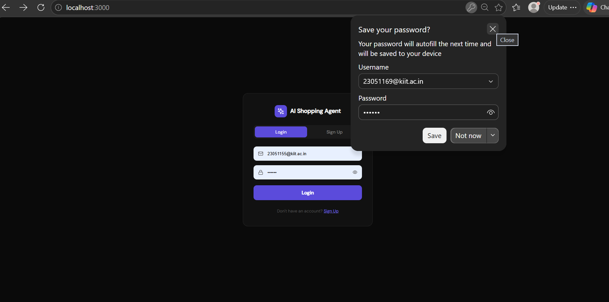
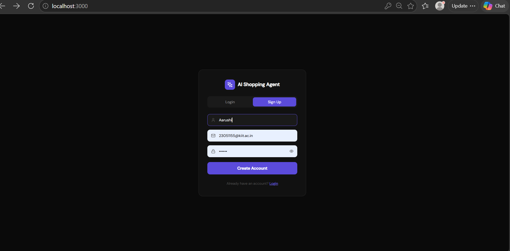
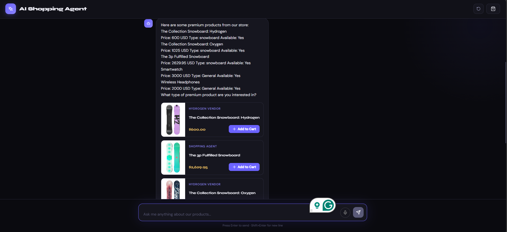
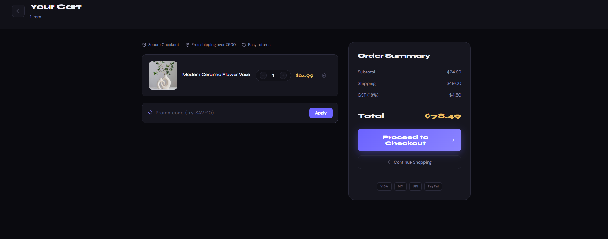
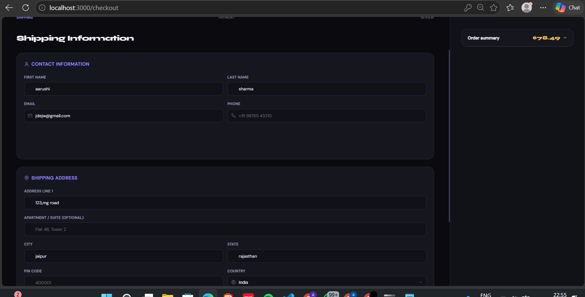
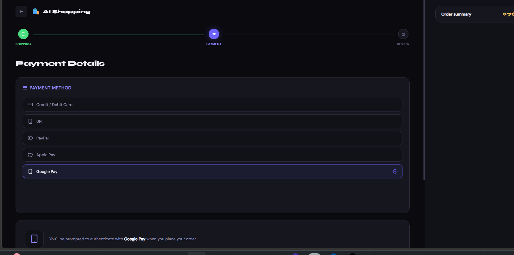

<div align="center">

# 🛍️ Shopping Tracker

### *Conversational Commerce, Reimagined*

**An AI-powered shopping assistant that transforms Shopify stores into intelligent, chat-driven retail experiences**

<br/>


<br/>

> **ShopMind AI** bridges the gap between conversational AI and e-commerce — letting customers discover products through natural dialogue, get personalized recommendations, and complete purchases seamlessly, all within a single chat interface.

</div>

---

## 📌 Table of Contents

1. [Features](#-features)
2. [Screenshots](#-screenshots)
3. [Architecture & Workflow](#-architecture--workflow)
4. [Tech Stack](#-tech-stack)
5. [Project Structure](#-project-structure)
6. [Getting Started](#-getting-started)
7. [Environment Variables](#-environment-variables)
8. [Running the App](#-running-the-app)
9. [AI Chat Workflow](#-ai-chat-workflow)
10. [Checkout Flow](#-checkout-flow)
11. [Future Improvements](#-future-improvements)
12. [Author](#-author)

---

## ✨ Features

| Feature | Description |
|---|---|
| 🤖 **AI Shopping Agent** | Conversational assistant powered by Groq's Llama 3.1 — understands needs, budget, and preferences |
| 🛒 **Dynamic Product Discovery** | Real-time product fetching from Shopify Storefront API based on AI-parsed user intent |
| 💬 **Natural Language Interface** | Users describe what they want in plain English; AI handles the rest |
| 🎯 **Personalized Recommendations** | Context-aware product suggestions filtered by price range, category, and user preferences |
| 🛍️ **Integrated Cart System** | Add, update, and remove items without leaving the chat experience |
| 💳 **Multi-Step Checkout Flow** | Smooth, guided checkout: Cart → Shipping → Payment → Review → Confirmation |
| 📦 **Order Management** | Full order review page and order success confirmation with summary |
| 🌙 **Responsive Dark UI** | Modern, mobile-first dark interface built for an immersive shopping experience |
| ⚡ **Low Latency AI** | Groq's ultra-fast inference delivers near-instant AI responses |

---
## 📸 Screenshots

<div align="center">

| Login Page | Sign Up Page |
|:-:|:-:|
|  |  |

| AI Chat Interface | Product Recommendations |
|:-:|:-:|
|  |  |

| Cart & Checkout | Order Details |
|:-:|:-:|
|  |  |

| Order Success |
|:-:|
|  |


</div>

---

## 🏗️ Architecture & Workflow

```
┌─────────────────────────────────────────────────────────────────┐
│                        CLIENT (React)                           │
│                                                                 │
│   ┌──────────┐    ┌──────────────┐    ┌─────────────────────┐  │
│   │ Chat UI  │───▶│  Cart State  │───▶│  Checkout Flow UI   │  │
│   └──────────┘    └──────────────┘    └─────────────────────┘  │
│         │                                                       │
└─────────┼───────────────────────────────────────────────────────┘
          │ HTTP / REST (Axios)
          ▼
┌─────────────────────────────────────────────────────────────────┐
│                    SERVER (Node.js / Express)                   │
│                                                                 │
│   ┌─────────────────┐         ┌──────────────────────────────┐ │
│   │   /api/chat     │────────▶│       Groq API               │ │
│   │  (AI Handler)   │◀────────│  (Llama 3.1 — Intent Parse,  │ │
│   └────────┬────────┘         │   Recommendations, Chat)     │ │
│            │                  └──────────────────────────────┘ │
│            ▼                                                    │
│   ┌─────────────────┐         ┌──────────────────────────────┐ │
│   │ /api/products   │────────▶│    Shopify Storefront API    │ │
│   │ (Product Fetch) │◀────────│  (Products, Collections,     │ │
│   └─────────────────┘         │   Variants, Pricing)        │ │
│                                └──────────────────────────────┘ │
└─────────────────────────────────────────────────────────────────┘
```

### Request Lifecycle

```
User types message
      │
      ▼
React sends POST /api/chat
      │
      ▼
Express extracts intent via Groq (Llama 3.1)
      │
      ├──▶ Detects product query → fetches from Shopify Storefront API
      │         │
      │         └──▶ Filters by budget / category / keywords
      │
      └──▶ Builds AI response with product recommendations
                │
                ▼
      React renders chat reply + product cards
                │
                ▼
      User adds to cart → proceeds to multi-step checkout
```

---

## 🛠️ Tech Stack

### Frontend
| Technology | Purpose |
|---|---|
| **React 18** | UI framework with hooks-based state management |
| **React Router DOM** | Multi-page routing (chat, cart, checkout, order) |
| **Axios** | HTTP client for API communication |
| **Lucide React** | Clean, consistent icon library |
| **CSS (Custom)** | Responsive dark UI with custom animations |

### Backend
| Technology | Purpose |
|---|---|
| **Node.js** | JavaScript runtime environment |
| **Express.js** | REST API server and middleware management |
| **Shopify Storefront API** | GraphQL-powered product, collection & cart data |
| **Groq API (Llama 3.1)** | Ultra-fast LLM inference for conversational AI |

---

## 📁 Project Structure

```
shopmind-ai/
│
├── client/                          # React Frontend
│   ├── public/
│   │   └── index.html
│   ├── src/
│   │   ├── components/
│   │   │   ├── ChatWindow.jsx       # Main AI chat interface
│   │   │   ├── MessageBubble.jsx    # Individual chat message
│   │   │   ├── ProductCard.jsx      # AI-recommended product display
│   │   │   ├── CartSidebar.jsx      # Slide-in cart panel
│   │   │   ├── CartItem.jsx         # Individual cart item
│   │   │   ├── CheckoutForm.jsx     # Shipping & payment forms
│   │   │   ├── OrderReview.jsx      # Pre-submission order summary
│   │   │   └── OrderSuccess.jsx     # Post-order confirmation page
│   │   ├── pages/
│   │   │   ├── Chat.jsx             # Chat page
│   │   │   ├── Cart.jsx             # Cart page
│   │   │   └── Checkout.jsx         # Checkout flow page
│   │   ├── context/
│   │   │   └── CartContext.jsx      # Global cart state (React Context)
│   │   ├── services/
│   │   │   └── api.js               # Axios API calls
│   │   ├── styles/
│   │   │   └── *.css                # Component-level stylesheets
│   │   ├── App.jsx
│   │   └── main.jsx
│   └── package.json
│
├── server/                          # Node.js / Express Backend
│   ├── routes/
│   │   ├── chat.js                  # AI chat endpoint
│   │   └── products.js              # Shopify product endpoints
│   ├── services/
│   │   ├── groqService.js           # Groq API integration (Llama 3.1)
│   │   └── shopifyService.js        # Shopify Storefront API integration
│   ├── middleware/
│   │   └── errorHandler.js          # Centralized error handling
│   ├── .env                         # Environment variables (git-ignored)
│   ├── index.js                     # Express app entry point
│   └── package.json
│
├── screenshots/                     # Project screenshots (add yours here)
├── .gitignore
└── README.md
```

---

## 🚀 Getting Started

### Prerequisites

Ensure you have the following installed:

- **Node.js** v18 or higher — [Download](https://nodejs.org/)
- **npm** v9 or higher
- A **Shopify store** with Storefront API access — [Get started](https://shopify.dev/docs/api/storefront)
- A **Groq API key** — [Get yours free](https://console.groq.com/)

### Installation

**1. Clone the repository**

```bash
git clone https://github.com/your-username/shopmind-ai.git
cd shopmind-ai
```

**2. Install backend dependencies**

```bash
cd server
npm install
```

**3. Install frontend dependencies**

```bash
cd ../client
npm install
```

---

## 🔑 Environment Variables

Create a `.env` file inside the `/server` directory:

```env
# ── Server ────────────────────────────────────────────
PORT=5000

# ── Groq API ──────────────────────────────────────────
GROQ_API_KEY=your_groq_api_key_here

# ── Shopify Storefront API ────────────────────────────
SHOPIFY_STORE_DOMAIN=your-store.myshopify.com
SHOPIFY_STOREFRONT_ACCESS_TOKEN=your_storefront_access_token_here
```

> ⚠️ **Never commit your `.env` file.** It is already listed in `.gitignore`.

#### Where to find your Shopify credentials:
- Go to **Shopify Admin → Apps → Develop apps**
- Create a new app and enable **Storefront API** access
- Copy the **Storefront API access token** and your store's `.myshopify.com` domain

---

## ▶️ Running the App

### Start the Backend (from `/server`)

```bash
npm run dev
# Server starts at http://localhost:5000
```

### Start the Frontend (from `/client`)

```bash
npm run dev
# App starts at http://localhost:5173
```

> Both servers must be running simultaneously. Open **http://localhost:5173** in your browser.

---

## 🤖 AI Chat Workflow

The AI shopping assistant uses a structured pipeline to convert natural language into relevant product recommendations:

```
Step 1 — User Input
  User: "I'm looking for a birthday gift under ₹2000, something for a fitness lover"

Step 2 — Intent Extraction (Groq / Llama 3.1)
  AI parses: { category: "fitness", budget: 2000, occasion: "birthday gift" }

Step 3 — Product Fetching (Shopify Storefront API)
  GraphQL query → fetches products filtered by category & price range

Step 4 — AI Response Generation
  Llama 3.1 crafts a friendly, contextual response with product suggestions

Step 5 — UI Rendering
  Chat message + interactive product cards displayed in the chat window

Step 6 — Add to Cart
  User clicks "Add to Cart" → item added to global cart state
```

**Conversation memory** is maintained across the session, so the AI remembers earlier preferences and refines recommendations as the conversation evolves.

---

## 💳 Checkout Flow

The checkout experience is broken into clear, guided steps to minimize friction:

```
┌──────────┐    ┌────────────┐    ┌─────────────┐    ┌──────────────┐    ┌─────────────┐
│   Cart   │───▶│  Shipping  │───▶│   Payment   │───▶│    Review    │───▶│   Success   │
│  Review  │    │    Info    │    │     UI      │    │    Order     │    │    Page     │
└──────────┘    └────────────┘    └─────────────┘    └──────────────┘    └─────────────┘
```

| Step | Description |
|---|---|
| **1. Cart Review** | View all items, adjust quantities, see total pricing |
| **2. Shipping Info** | Enter name, address, city, state, and postal code |
| **3. Payment UI** | Secure card input form with CVV and expiry fields |
| **4. Order Review** | Full summary of items, shipping details, and total cost |
| **5. Order Success** | Confirmation page with order ID, summary, and next steps |

---

## 🔮 Future Improvements

- [ ] 🔐 **User Authentication** — Login/signup with persistent order history
- [ ] 💾 **Conversation Persistence** — Save and reload past chat sessions
- [ ] 🌐 **Multi-language Support** — AI responses in Hindi, Spanish, etc.
- [ ] 📊 **Analytics Dashboard** — Track most-asked queries and popular products
- [ ] 🔎 **Advanced Filtering** — Filter by ratings, brands, color, and size in chat
- [ ] 📱 **PWA Support** — Installable mobile app experience
- [ ] 🎙️ **Voice Input** — Talk to the shopping assistant using speech recognition
- [ ] 🧠 **Fine-tuned Model** — Custom Llama fine-tune on product catalog data
- [ ] 📦 **Real Order Processing** — Full Shopify Checkout API integration for live orders
- [ ] 🔔 **Push Notifications** — Order updates and abandoned cart reminders

---

## 👨‍💻 Author

<div align="center">

**Built with ❤️ by Aarushi Sharma**

[](https://github.com/your-username)
[](https://linkedin.com/in/your-profile)
[](https://your-portfolio.dev)

*Open to full-stack, AI/ML, and product engineering roles.*

</div>

---


---

<div align="center">

*If you found this project helpful, please consider giving it a ⭐ on GitHub — it helps a lot!*

**ShopMind AI** · Built with React, Node.js, Groq, and Shopify Storefront API

</div>
